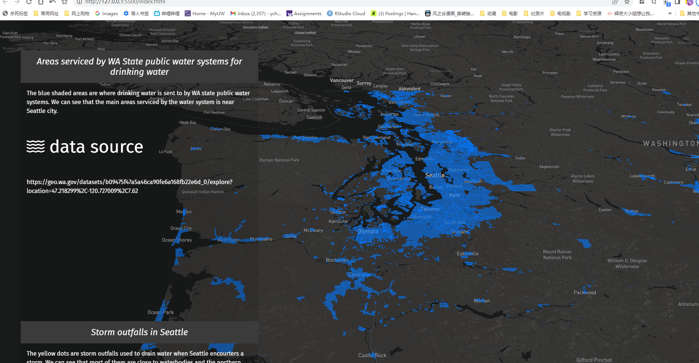
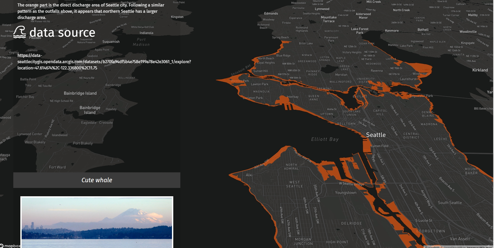

## Geo Narrative
# Water Flows in Seattle/Washington
This geo narrative consists of three maps, showing where the water flows out of Seattle and the service area of the State public water system for drinking water. 

[webmap](https://ychen21.github.io/Lab7GeoNarrative/)  
[resource for image and videos](https://www.pexels.com/zh-cn/)

(Sometimes the link above doesn't work right, the map can be launched successfully using vscode's go live function)
  

